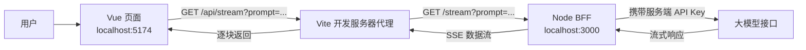

# Vue + Node 搭建全栈

在传统 Web 项目中，Vue、React 等前端应用通常只负责页面展示和用户交互，Java、Go 或 Node 服务则负责数据库访问、权限校验、并发控制以及业务接口。随着前端业务越来越复杂，前端与后端之间还可以加入一层专门服务于前端的 Node 服务，这一层通常被称为 **BFF（Backend For Frontend）**。

BFF 并不是要取代真正的业务后端，而是把数据聚合、接口适配、流式响应解析等与前端关系密切的工作集中到一处。前端工程师可以继续使用熟悉的 JavaScript 开发服务端逻辑，同时让 Vue 页面保持简单。

本文以 Vue 3、Vite、Node.js、Express 和大模型流式接口为例，搭建一个小型全栈项目，并重点说明前后端如何通信、Vite 代理如何解决开发环境中的跨域问题，以及 Node BFF 如何把上游流式响应转发给浏览器。

## 一、整体架构

这个项目包含三个角色：

1. **Vue 前端**：接收用户输入、发起请求并实时展示生成结果。
2. **Node BFF**：接收 Vue 的请求，保管服务端密钥，调用上游大模型，并把响应流转发给前端。
3. **大模型服务**：根据 prompt 生成内容，通过流式接口持续返回数据。



浏览器始终请求 `/api/...`，开发阶段由 Vite 将请求转发到 Node 服务。API Key 只存在于 Node 进程的环境变量中，不会暴露在浏览器代码里。

如果项目还有 Java 或 Go 编写的正式业务后端，也可以继续扩展为：

```text
Vue / React  →  Node BFF  →  Java / Go 业务后端
                         ↘  大模型服务
```

## 二、项目结构

项目将 Node 服务与 Vue 工程分开放置：

```text
sse/
├─ .env                    # 服务端环境变量，不提交到 Git
├─ package.json            # Node BFF 依赖
├─ server.mjs              # Express 服务入口
└─ vite1/
   ├─ package.json         # Vue 前端依赖
   ├─ vite.config.js       # Vite 配置及开发代理
   └─ src/
      ├─ main.js           # Vue 应用入口
      └─ App.vue           # 页面和流式请求逻辑
```

根目录和 `vite1` 是两个独立的 Node 工程，因此它们各自拥有 `package.json`，也需要分别安装依赖。

## 三、搭建 Node BFF

### 1. 安装依赖

在项目根目录安装 Express、dotenv 和 cors：

```bash
pnpm install
```

- `express` 用来创建 HTTP 服务和定义路由；
- `dotenv` 用来读取 `.env` 中的环境变量；
- `cors` 用来控制跨域访问。通过 Vite 代理访问时通常不需要 CORS，但保留它可以方便直接调试 Node 接口。

### 2. 配置环境变量

在根目录创建 `.env`：

```dotenv
DEEPSEEK_API_KEY=替换为自己的_API_Key
DEEPSEEK_API_URL=https://api.deepseek.com/v1/chat/completions
DEEPSEEK_MODEL=deepseek-chat
```

`.env` 必须加入 `.gitignore`。密钥一旦写进 `App.vue`，就会随前端资源下载到用户浏览器中，因此任何需要密钥的第三方请求都应该通过服务端发起。

### 3. 创建 Express 服务

一个基础服务只需要实例化 Express、定义路由并监听端口：

```js
import * as dotenv from 'dotenv'
import express from 'express'
import cors from 'cors'

dotenv.config({ path: ['.env.local', '.env'] })

const app = express()
const port = 3000

app.use(cors())

app.get('/', (req, res) => {
  res.send('Hello World!')
})

app.listen(port, () => {
  console.log(`Node BFF 已启动：http://localhost:${port}`)
})
```

运行服务：

```bash
node server.mjs
```

访问 `http://localhost:3000`，看到 `Hello World!` 就说明 Node 服务已经启动。

## 四、在 BFF 中转发流式响应

普通 RESTful 接口一般等待完整数据生成后再返回 JSON。大模型生成内容可能耗时较长，如果等待全部完成，页面会长时间没有反馈。流式接口则会把生成结果分成多个数据块持续发送，前端收到一块就展示一块。

SSE（Server-Sent Events，服务器发送事件）是一种基于 HTTP 的单向推送方式，服务端通常以 `text/event-stream` 类型返回内容。这里仍然使用 `fetch` 发起请求，因为 `fetch` 能直接读取 `ReadableStream`，也更方便处理请求失败和自定义数据格式。

在 `server.mjs` 中增加 `/stream` 路由：

```js
app.get('/stream', async (req, res) => {
  const prompt = String(req.query.prompt ?? '').trim()

  if (!prompt) {
    return res.status(400).json({ message: 'prompt 不能为空' })
  }

  try {
    const upstream = await fetch(
      process.env.DEEPSEEK_API_URL ??
        'https://api.deepseek.com/v1/chat/completions',
      {
        method: 'POST',
        headers: {
          Authorization: `Bearer ${process.env.DEEPSEEK_API_KEY}`,
          'Content-Type': 'application/json',
        },
        body: JSON.stringify({
          model: process.env.DEEPSEEK_MODEL ?? 'deepseek-chat',
          stream: true,
          messages: [{ role: 'user', content: prompt }],
        }),
      },
    )

    if (!upstream.ok || !upstream.body) {
      const detail = await upstream.text()
      return res.status(upstream.status || 502).json({
        message: '上游模型请求失败',
        detail,
      })
    }

    res.status(200)
    res.setHeader('Content-Type', 'text/event-stream; charset=utf-8')
    res.setHeader('Cache-Control', 'no-cache, no-transform')
    res.setHeader('Connection', 'keep-alive')
    res.flushHeaders()

    const reader = upstream.body.getReader()

    while (true) {
      const { value, done } = await reader.read()
      if (done) break
      res.write(value)
    }

    res.end()
  } catch (error) {
    console.error(error)

    if (!res.headersSent) {
      res.status(500).json({ message: 'BFF 请求模型失败' })
    } else {
      res.end()
    }
  }
})
```

这段代码完成了四件事：

1. 从查询参数中读取并校验 `prompt`；
2. 由 Node 携带 API Key 请求上游大模型；
3. 设置 SSE 所需的响应头；
4. 通过 `ReadableStream` 的 reader 逐块读取上游数据，并使用 `res.write()` 立即转发给浏览器。

仅仅执行 `console.log(upstream.body)` 只能看到一个 `ReadableStream` 对象，并不会把模型生成的内容返回给 Vue；Node 必须真正读取并转发这个流。

## 五、Vue 前端读取响应流

Vue 应用从 `main.js` 启动并挂载根组件：

```js
import { createApp } from 'vue'
import App from './App.vue'

createApp(App).mount('#app')
```

在 `App.vue` 中使用响应式变量保存输入和结果。点击按钮后，通过 `fetch` 请求 BFF，再用 `ReadableStreamDefaultReader` 逐块读取数据：

```vue
<script setup>
import { ref } from 'vue'

const prompt = ref('')
const message = ref('')
const loading = ref(false)

async function generate() {
  if (!prompt.value.trim() || loading.value) return

  message.value = ''
  loading.value = true

  try {
    const response = await fetch(
      `/api/stream?prompt=${encodeURIComponent(prompt.value)}`,
    )

    if (!response.ok || !response.body) {
      throw new Error(`请求失败：${response.status}`)
    }

    const reader = response.body.getReader()
    const decoder = new TextDecoder()
    let buffer = ''

    while (true) {
      const { value, done } = await reader.read()
      if (done) break

      buffer += decoder.decode(value, { stream: true })
      const events = buffer.split(/\r?\n\r?\n/)
      buffer = events.pop() ?? ''

      for (const event of events) {
        const data = event
          .split(/\r?\n/)
          .filter((line) => line.startsWith('data:'))
          .map((line) => line.slice(5).trimStart())
          .join('\n')

        if (!data) continue
        if (data === '[DONE]') return

        try {
          const json = JSON.parse(data)
          message.value += json.choices?.[0]?.delta?.content ?? ''
        } catch {
          // 上游如果直接返回文本，也可以原样展示
          message.value += data
        }
      }
    }
  } catch (error) {
    message.value = error instanceof Error ? error.message : '请求失败'
  } finally {
    loading.value = false
  }
}
</script>

<template>
  <main>
    <h1>Vue + Node 全栈流式输出</h1>

    <textarea v-model="prompt" placeholder="请输入问题"></textarea>
    <button :disabled="loading" @click="generate">
      {{ loading ? '生成中…' : '发送' }}
    </button>

    <pre>{{ message }}</pre>
  </main>
</template>
```

需要特别注意：`response.json()` 会等待整个响应结束，并尝试把完整内容解析成一个 JSON 对象，它适合普通 JSON 接口，却不适合持续返回多个 SSE 事件的流式接口。要实现“生成一个字、页面显示一个字”的效果，必须通过 `response.body.getReader()` 消费数据流。

TCP 数据块的边界也不等于 SSE 事件的边界。一次 `reader.read()` 可能只收到半个事件，也可能同时收到多个事件，因此示例使用 `buffer` 保存尚未结束的数据，并按空行切分完整事件。

## 六、使用 Vite 代理解决开发环境跨域

浏览器的同源策略要求页面与接口的协议、域名和端口都相同。开发阶段，Vue 页面运行在 `http://localhost:5174`，Node 服务运行在 `http://localhost:3000`，端口不同，因此直接请求 Node 接口属于跨域请求。

可以在 `vite.config.js` 中配置开发代理：

```js
import { defineConfig } from 'vite'
import vue from '@vitejs/plugin-vue'

export default defineConfig({
  plugins: [vue()],
  server: {
    port: 5174,
    proxy: {
      '/api': {
        target: 'http://localhost:3000',
        changeOrigin: true,
        secure: false,
        rewrite: (path) => path.replace(/^\/api/, ''),
      },
    },
  },
})
```

现在，前端只需请求：

```js
fetch('/api/stream?prompt=hello')
```

请求的实际流转过程为：

```text
浏览器请求  http://localhost:5174/api/stream?prompt=hello
       ↓ Vite 匹配 /api 并删除此前缀
代理请求    http://localhost:3000/stream?prompt=hello
       ↓
Express 命中 app.get('/stream', ...)
```

对浏览器来说，请求仍然发往 `5174` 端口，因此不会触发跨域限制。需要注意，Vite 代理只在开发服务器中生效；生产环境通常使用 Nginx、云平台路由或同一个 Node 服务，把 `/api` 转发到 BFF。

## 七、启动完整项目

项目需要同时运行前后端两个进程。

第一个终端启动 Node BFF：

```bash
cd sse
pnpm install
node server.mjs
```

第二个终端启动 Vue：

```bash
cd sse/vite1
npm install
npm run dev
```

然后根据终端提示打开 `http://localhost:5174`。前端请求 `/api/stream`，Vite 将它代理到 `3000` 端口的 Node 服务，Node 再请求大模型并逐块返回结果。

## 八、从演示项目走向生产环境

这个示例已经形成了完整的前端、BFF 和上游服务调用链，但生产环境还应补充以下能力：

- **限制 CORS 来源**：不要无条件向所有网站开放接口；使用同源部署时可以移除 `cors()`。
- **参数校验和长度限制**：限制 prompt 长度，拒绝空值和异常参数。
- **身份认证和限流**：避免任何人无限消耗模型额度。
- **请求中断**：浏览器断开连接时，同时取消 Node 到上游模型的请求。
- **超时与重试**：为上游请求设置合理超时；流式请求的重试需要防止内容重复。
- **统一错误格式**：在响应头尚未发出时返回 JSON 错误，开始流式传输后则使用约定的 SSE 错误事件。
- **日志与监控**：记录请求耗时、状态码和上游错误，但不要记录 API Key 等敏感信息。
- **生产代理配置**：使用 Nginx 等代理 SSE 时关闭响应缓冲，否则数据可能被攒成一大块后才到达浏览器。

## 总结

Vue + Node 的全栈模式并不是简单地把两种技术放在一起，而是让它们承担清晰的职责：Vue 负责交互和状态展示，Node BFF 负责密钥保护、接口适配、数据聚合和流式转发，正式后端或第三方服务负责核心数据与计算。

在这个架构中，前端始终调用简洁、稳定的 `/api` 接口，不需要理解不同上游服务的认证方式和复杂数据结构；Node 则成为浏览器与业务服务之间的适配层。对于大模型对话、数据聚合、文件处理等前端业务较重的场景，这是一种轻量、实用且容易逐步扩展的全栈方案。
